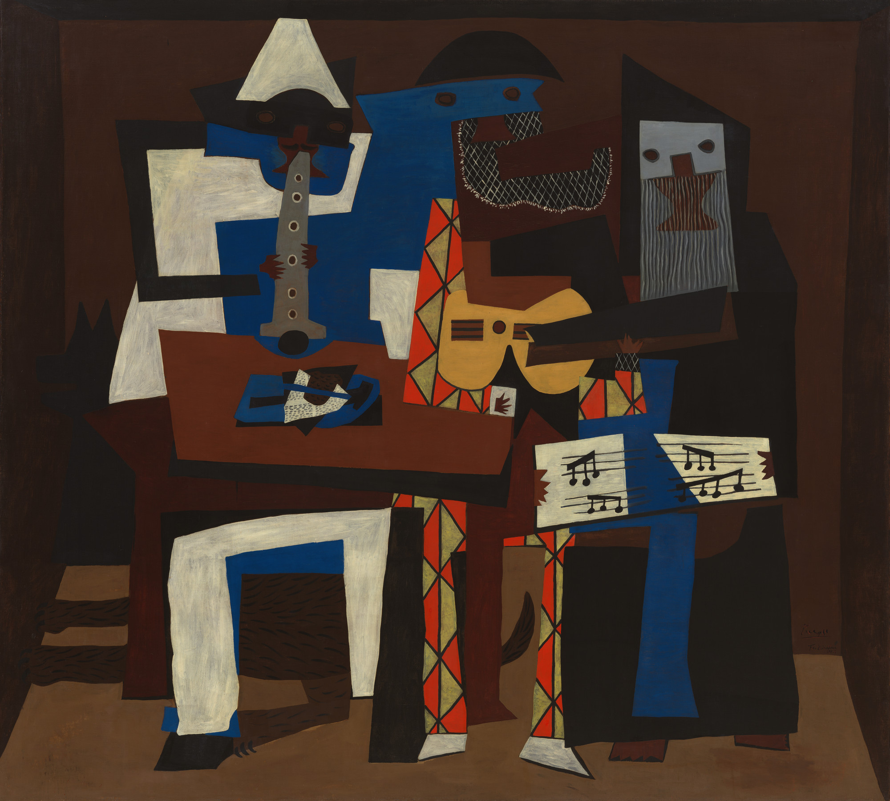

# Picasso-Inspired Three Musicians

## Overview

This project is my attempt to create a loose copy of Pablo Picasso's famous painting "Three Musicians" using colored pencils.

## Inspiration

The original "Three Musicians" is a notable work from Picasso's Synthetic Cubist period, painted in 1921. It features three musicians in costume, rendered in a fragmented, geometric style characteristic of Cubism.

